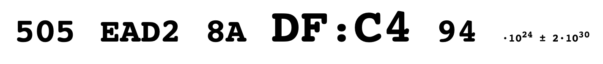

# Planck Clock

This is a clock and a calendar displaying time in Planck units, in hex, from the Big Bang (the error bar is displayed and is very large).

This is intended for fun (given the huge error bar) and as a demonstration of what clocks might look like in a distant future when humans are interplanetary, and the time from the Big Bang is known with subsecond precision.

## Installation

To install, configure your webserver to serve the website from `/var/www/clock/`, and run `./install.sh` from the repository root.
